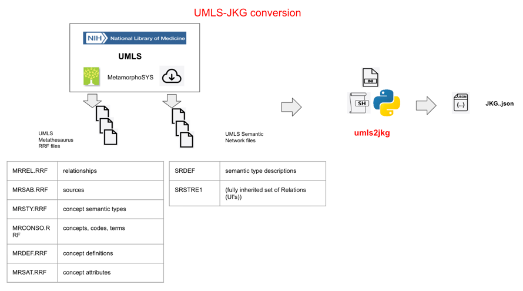

# Universal Biomedical Knowledge Graph - JSON Knowledge Graph format (UBKG-JKG)
## UMLS to JKG Converter

# Background
## UBKG
UBKG is a framework for building and distributing knowledge graphs of assertions obtained 
from multiple biomedical data sources. The UBKG extends the _concept-code synonymy_ of the UMLS 
(where a single _concept_ can be represented by _codes_ in multiple vocabularies), combining UMLS
concept data with information from other sources. For a detailed explanation of the 
UBKG, consult the [UBKG documentation](https://ubkg.docs.xconsortia.org/).

The initial release of the UBKG was a knowledge graph with a schema that adhered closely to the UMLS architecture. 
In particular, almost all properties of concepts and codes (representations of concepts in vocabularies), including
terms and definitions, were nodes in the UBKG. Although this schema supported knowledge graph analysis, it
was complex and bound both to the UMLS architecture and the neo4j platform. 

## JKG
The [JSON Knowledge Graph](https://github.com/x-atlas-consortia/json-knowledge-graph), or JKG schema supports a simple,
platform-agnostic structure for a knowledge graph, as well as specification for transferring data between knowledge graphs.
The JKG schema consists of two types of arrays:
- **nodes**, with elements for 
  - sources (e.g., vocabularies)
  - semantic types
  - relationships
  - concepts
  - terms
- **rels**, with elements that describe relationships
  - between semantic types (i.e., that describes a semantic type hierarchy)
  - between concepts and concepts
  - between concepts and codes

## umls2jkg
Applications in this repository convert source data obtained from the UMLS to a JSON file that
conforms to the JKG schema.

#### Components
1. **umls2jkg.py**:  Python application that:
   - reads UMLS data files
   - transforms UMLS data to JKG format
   - writes to output
2. **umls2jkg.sh**:  Shell script that:
   - establishes a Python virtual environment for the **umls2kg.py** script
   - executes the **umls2kg.py** script

3. **umls2kjg.ini**: configuration file that drives the execution of the **umls2kg.py** script

# Prerequisites
## Metathesaurus and Semantic Network files
The [UMLS](https://www.ncbi.nlm.nih.gov/books/NBK9676/) includes:
- the [Metathesaurus](https://www.ncbi.nlm.nih.gov/books/NBK9684/)
- the [Semantic Network](https://www.ncbi.nlm.nih.gov/books/NBK9679/)

The UMLS provides data files for the Metathesaurus and Semantic Network 
by means of the [MetamorphoSys](https://www.ncbi.nlm.nih.gov/books/NBK9683/) application. 

The **umls2kjg** application reads from a subset of the data files from both the
Metathesaurus and Semantic Network.

### MetamorphoSys configuration
The MetamorphoSys application allows the selection of subsets of UMLS data. Configuration options include:
- selection of specific SABs
- exclusion by license restriction

The **umls2kjg** application expects only that data from both the Metathesaurus and Semantic Network are available.
The application does not expect particular SAB content.

Refer to the [UMLS Reference Manual](https://www.ncbi.nlm.nih.gov/books/NBK9683/) for instructions on configuring and running MetamorphoSys.

#### Running MetamorphoSys
The UMLS provides MetamorphoSys as part of a [UMLS Full Release](https://www.nlm.nih.gov/research/umls/licensedcontent/umlsknowledgesources.html).
After expanding the release Zip archive, a user runs the MetamorphoSys executable to prepare and export the Metathesaurus and Semantic Network files.

##### MacOs considerations
Metamorphosys runs in Windows, Linux, and MacOs. Before running Metamorphosys on a MacOs machine,
move the **release.dat** file from its position in the Zip root to the _/META_ subdirectory. MetamorphoSys will not run
on a MacOs machine until the **release.dat** file is in the expected location.

#### File export
A full release Zip is very large. For example, the 2025AB release file expands to almost 40 GB.

## Machine characteristics
### Operating System
The **umls2jkg** application was developed on a MacOs machine running Tahoe 26.2.

### Memory
It is recommende that the host machine have at least 32 GB of RAM.

### Disk space
The host machine should have at least enough disk space to accomodate data files and the output.

Disk space requirements:

| Type of file          | Disk space (GB) |
|-----------------------|-----------------|
| UMLS full release ZIP | >5              |
| MetamorphoSys files   | >50             |
| JKG.JSON output       | ~5 GB           |

# Application configuration
The **umls2kjg.ini** file drives the operation of the **umls2jkg.py** script.
It is likely that the user will need to edit only a few values in the 
configuration file, including:

| section     | key             | value                                                                                                                    |
|-------------|-----------------|--------------------------------------------------------------------------------------------------------------------------|
| directories | umls_dir        | absolute path to the root folder of the MetamorphoSys output--i.e., the parent directory of the META and NET directories |
|             | output_dir      | absolute path to which to write output                                                                                   |
| json_out    | output_filename | file name of the JKG JSON output                                                                                         |
|             | pretty          | true=write output with indentation                                                                                       |
|             | indent          | indentation when pretty=true                                                                                             |
| debug       | debug_n_rows    | The number of rows to read from data files. A value of 0 will result in all rows being read                              |

## Pretty printing
It is possible to "pretty print" the output file--i.e., generate output with spacing and indentation. 
Although pretty-printing increases the legibility of the file, it also dramatically increases the size of the output file, due to the large number of
entries.

## Software
### Python
The **umls2jkg** application was developed in Python 3.13.

### Packages
**umls2jkg** uses the following packages:
- [Polars](https://pola.rs/) to analyze the extremely large UMLS data files
- [tqdm](https://tqdm.github.io/) for progress indicators

# Application workflow

The **umls2kg** application reads and combines content from UMLS data files to 
build elements in the arrays of the JGK JSON file.

Counts of elements are based on the default export from MetamorphoSys.

## nodes

| type                        | description                                                                  | # elements |
|-----------------------------|------------------------------------------------------------------------------|------------|
| Source                      | source vocabularies, including the UMLS                                      | ~110       |
| Semantic Network Node_Label | Semantic Network nodes                                                       | ~130       |
| Rel_Label                   | relationship predicates used between concepts and between concepts and codes | ~500       |
| Concept                     | concepts                                                                     | ~3.2M      |
| Term                        | code terms (e.g., PT)                                                        | ~7.6M      |                                                                    

## rels

| type                | description                                         | # elements |
|---------------------|-----------------------------------------------------|------------|
| Semantic Network    | relationships between nodes in the Semantic Network | ~600       |
| concept-to-concept  | relationships between concepts                      | ~10.4M     |
| concept-to-code     | relationships between concepts and codes            | ~8.8M      |
| NDC code-to-concept | mapping of NDC codes to RxNorm concepts             | ~250K      |

# File processing and timing

The time that the **umls2jkg** application requires to process UMlS data depends on 
a number of factors. However, it is possible to provide reasonable estimates for timing.

## Scanning and reading
The Polars package works with large files using columnar processing and lazy loading. 
This results in very fast processing of large files: for example, **umls2jkg** can scan a 9 GB file (MRREL.RRF) in less than 40 seconds.

Unlike row-based packages like Pandas, Polars processes an entire file at once. It is often not possible to track the progress of processing.

To give an idea of how long a file might take to process, **umls2jkg** application provides historical estimates of the times required to process files, under
ideal conditions. 

## Cleaning
Three Metathesaurus files (MRCONSO.RRF; MRDEF.RRF; and MRSAT.RRF) contain rows with text includes quote characters. 
Because Polars cannot scan files with these characters, it is necessary to remove quote characters from the files.

**umls2jkg** looks for cleaned versions of these files in the output directory. If a file is not present, the application creates a cleaned version of the file.

## Historical processing times
The following times were for the processing of the full 2025AB release, on a MacOs machine with 32GB RAM and no other processes competing for resources.

Time to scan, clean, and process files: 11 minutes, 14 seconds.

| Step              | time (mm:ss) | file size |
|-------------------|--------------|-----------|
| scan MRREL.RRF    | 1:10         | 9GB       |
| scan MRSAB.RRF    | <00:01       | <1 MB     |
| scan MRDOC.RRF    | <00:01       | <1 MB     |
| clean MRCONSO.RRF | <00:10       | 2 GB      |
| scan MRCONSO.RRF  | <00:10       | 2 GB      |
| clean MRDEF.RRF   | <00:01       | <1 MB     |
| scan MRDEF.RRF    | <00:01       | <1 MB     |
| scan SRDEF        | <00:01       | <1 MB     |
| build nodes array | <01:00       |           |
| scan SRSTRE1      | < 01:00      | <1 MB     |
| clean MRSAT.RRF   | <01:00       | 9GB       |
| scan MRSAT.RRF    | <03:00       |           |
| build rels array  | <05:00       |           |          |

# Output

**umls2jkg** writes all output to the path specified by the _output_dir_ and _output_filename_ keys in **umls2kjg.ini**.

In addition, the application writes cleaned versions of Metathesaurus file to the output directory.

